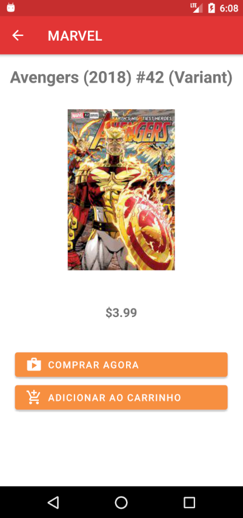
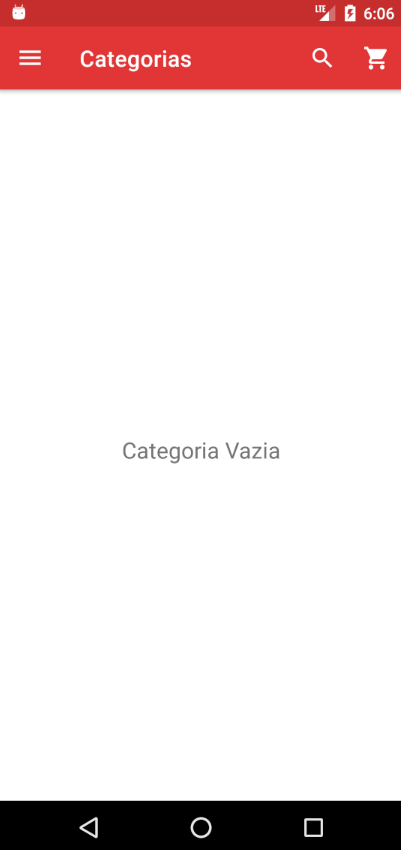

# Ecommerce Marvel

Para a realização do projeto fui utilizada a api da marvel : https://developer.marvel.com


Foi gerado o projeto com o Drawer pronto para utilizar o menu de forma mais rápida.

* **

## Api Marvel

* Utilizando a api marvel, são gerados duas chaves:
  
  * Privada
  * Pública
    
* No projeto foi inserido as chaves disponibilizadas em: 

```
    com.estudoparajava.marvelstore.entityAPI/Constants
 ```
   
* Segundo a documentação para realizar a requisição precisa: 

    * Chave privada: ex = abcd

    * Chave pública: ex = 1234

    * ts, um carimbo de data/hora: ex = 1

    * Com isso, tem que gerar uma hash para acrescentar no link

        * A hash gerada pelo exemplo é: ffd275c5130566a2916217b101f26150

  * No fim o link deve se comportar da seguinte forma: http://gateway.marvel.com/v1/public/comics?ts=1&apikey=1234&hash=ffd275c5130566a2916217b101f26150


  No AndroidManifest.xml foi adicionado:

  ```XML
     <uses-permission android:name="android.permission.INTERNET" />
  ```

  No projeto foi criado um arquivo para realizar a requisição: 
  
    ```Java
        public static HttpUrl API_URL = HttpUrl.parse("http://gateway.marvel.com/v1/public/");  

        private static final String PATH_COMIC = "comics";

        HttpUrl url = API_URL.newBuilder()
                .addPathSegment(PATH_COMIC)
                .addQueryParameter("ts", Constants.getTs())
                .addQueryParameter("apikey", Constants.getApiKey())
                .addQueryParameter("hash", StringHash.encryptMD5())
                .addQueryParameter("title", query)
                //.addQueryParameter("orderBy", "title")
                .addQueryParameter("limit", String.valueOf(10))
                .build();
    ```     

    * Acima mostra como foi pedido a requisição (o limite esta fixo em 10 por causa que foi realizado testes para confirmar se a hash estava funcionando normalmente).

    * E para buscar o título também esta constante, porque tive diversos problemas para conseguir conectar ao servidor. 

* **

## Dependências 
    

* Foram utilizadas as seguintes dependências:

``` gradle

    // Para utilizar o código acima
    implementation(platform("com.squareup.okhttp3:okhttp-bom:4.9.0"))
    implementation("com.squareup.okhttp3:okhttp")
    implementation("com.squareup.okhttp3:logging-interceptor")

    
    //Para ajudar a retirar os dados da API
    implementation 'com.google.code.gson:gson:2.8.6'

    //Utilizar para listagem de objetos
    //noinspection GradleCompatible
    implementation 'com.android.support:cardview-v7:21.0.3'
    //noinspection GradleCompatible
    implementation 'com.android.support:recyclerview-v7:21.0.3'
```

* **
 
## Dados utilizados

* Para compreender os dados foi salvo um arquivo:

```
    com/estudoparajava/marvelstore/data/Data
```
* Gerado as classes de acordo com os dados da API como mostra no pacote:

```
    com.estudoparajava.marvelstore.entityAPI
```

## Construção do Layout

* Já como o menu feito, foram adicionado 4 fragments:

    * Loja
    * Carrinho
    * Pedidos
    * Categorias

  obs: Era para Categorias ser a página principal para não deixar o aplicativo lento toda vez que voltar para o inicio(por conta da requisição). Foi realizado desta jeito por causa de erros na hash, então, para ver o resultado mais rápido(os dados obtidos da api) foi realizado assim:


<p align="center">

</p>

*  Na parte da loja, foi retirado os dados e adicionado em uma RecycleView, conformo mostra na imagem:

<p align="center">

</p>

* O código padrão para realizar as funcionalidades do RecycleView:

```
com/estudoparajava/marvelstore/recyclerItemClickListener/RecyclerItemClickListener.java
```

* Foi utilizado o RecycleView para melhorar a performance do app quando for pedido vários dados.

* Cada lista foi modelado de forma parecida, tanto na parte de loja, pedidos, e carrinho.

<p align="center">

</p>


* A tela de Descrição foi gerada e ao clicar em qualquer item de loja:

<p align="center">


</p>

* Gerado o layout do carrinho e do pedido (não foram utilizados os dados da api):
<p align="center">


</p>


* Não foi possível concluir a parte de categorias, mas a implementação era para ter como base a seguinte forma:

<p align="center">


</p>


* **

## Conclusão

*  O desfio foi ótimo, percebi que tenho que aprender algumas coisas a mais.

* Tive dificuldade com a hash, foi a primeira vez que usei e acabei demorando para achar o problema que era no ts.

* O erro de colocar a lista como tela principal. Toda vez que seleciona um item para visualizar a descrição dele e ao voltar para a página principal o app demora.

* Por conta da demora de encontrar os erros logo de inicio, não foi possível acrescentar mais funcionalidades ao aplicativo.

* Por fim, o desafio foi muito bom. Gostei demais!!!!